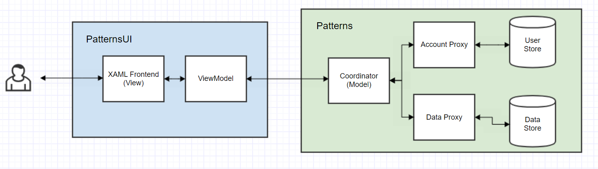
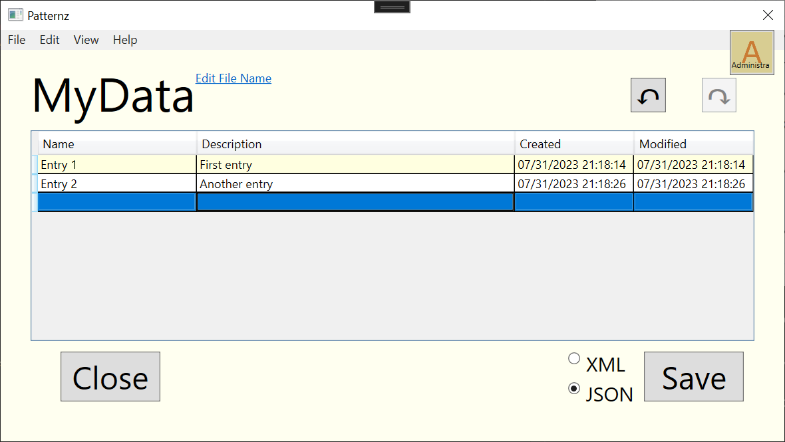
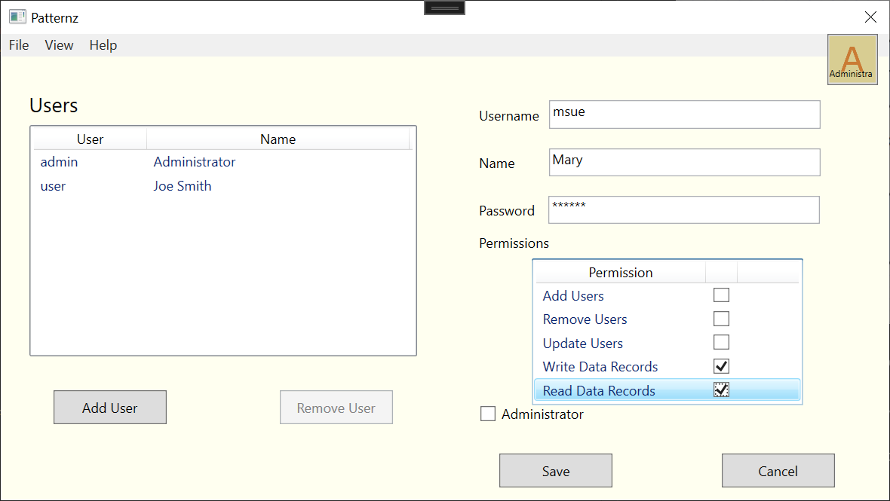
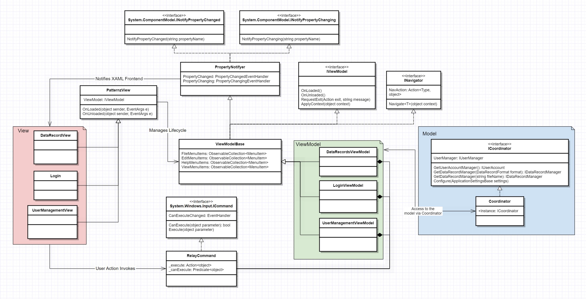
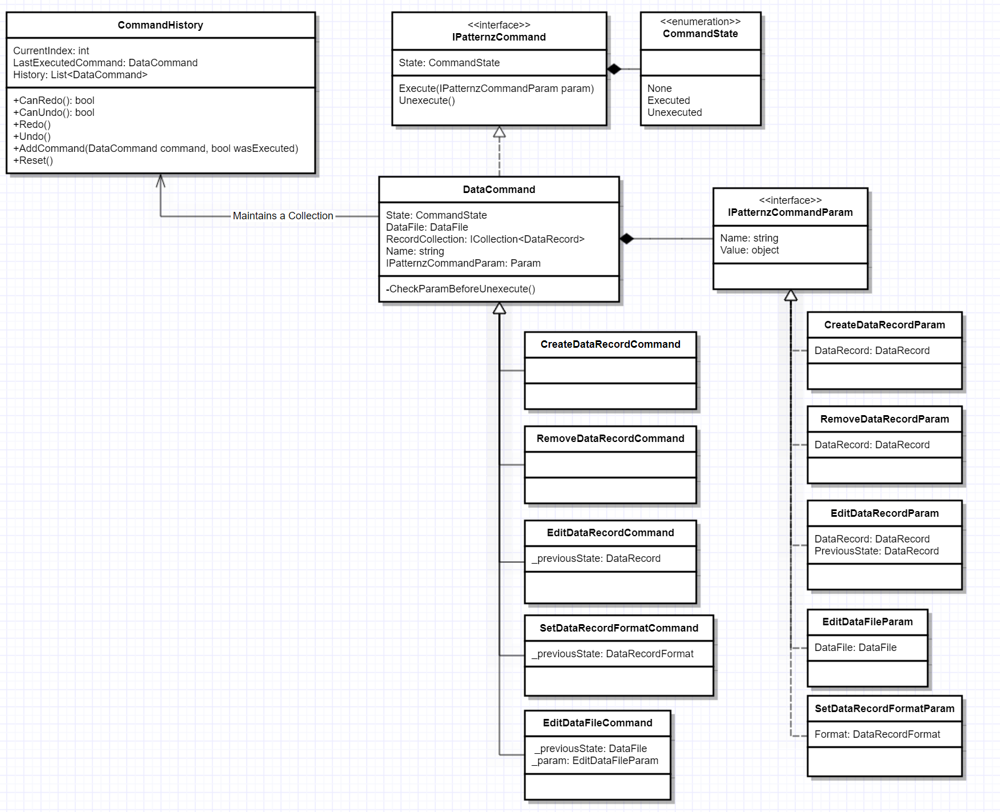
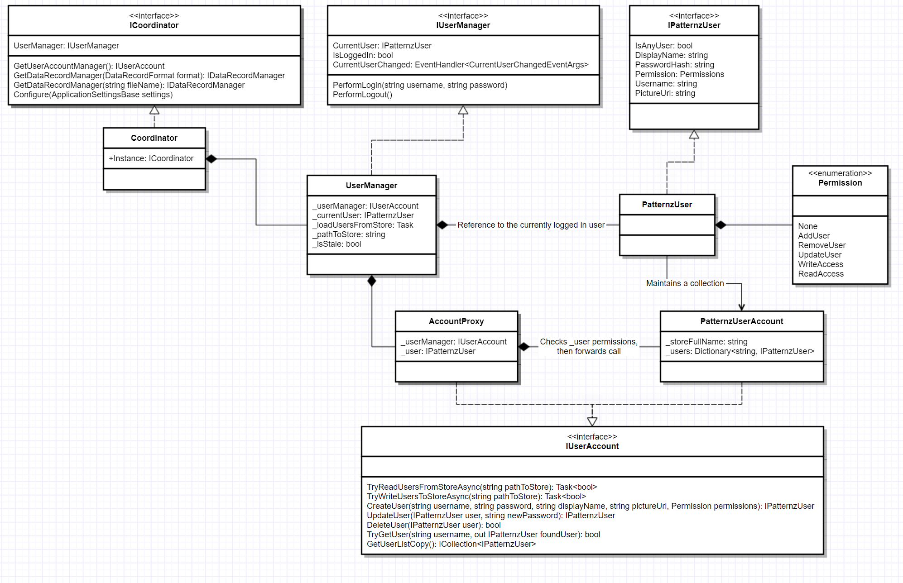
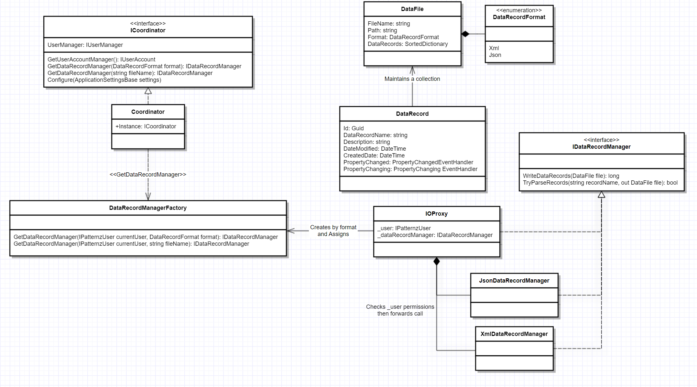
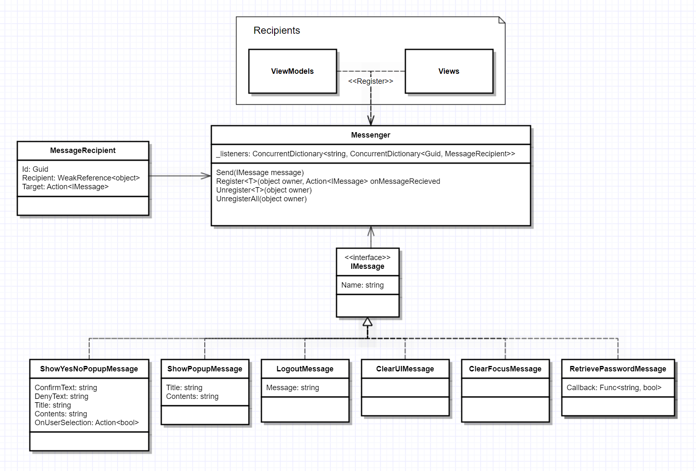

# Patternz
Patternz is a small application designed to be an educational tool used to learn about various common design patterns and their uses. At its core, Patternz can allow users to create, edit, and delete simple text files and maintain user records with varying permission levels. Although not terribly exciting at face value, it demonstrates the use of design patterns to showcase a flexible and maintainable codebase that could be applied to many common problems within the world of software development.

## Theory of Operation
The application is divided into two projects, a data project (Patterns) which produces a library and a UI Project (PatternsUI) which produces the executable. The data project contains functionality for managing users, reading and writing data and enforcing permissions. It is intended to be interacted with through a single point of entry, the Coordinator object, which is a singleton to encapsulate access to the functions provided by the library.

The UI application is largely organized by MVVM. The application consists of "pages" which are hosted by the main window. The logic of navigating between pages is defined in the main window and applied to each view model through a navigate property, delegating the responsibility of actual navigation to the view models when they determine it is appropriate to do so.

The main page of the application is the Data Records page. Here is where records would be managed. A file can be created or loaded if one already exists. The file consists of simple rows of names and descriptions, along with dates relevant. The format of the saved file can either be XML or JSON. Changes to files can be undone using the little circle arrow, or redone using the other little circle arrow. In order to load a file, the currently logged in user must have Read Access, and in order to save a file, the user must have Write Access.

The secondary page of the application is for managing users. Users can be added, updated or removed here. 

## Design Patterns
A variety of design patterns were utilized to create this application. A description of how the patterns were used follows.
### Model-View-ViewModel (MVVM)
The overall architecture of the application can be considered to be Model-View-Viewmodel. Other patterns are used as part of the architecture to facilitate communication between the three layers. 

In general, the user interacts directly with the view layer, such as by clicking buttons and typing. The view has exclusive control of what is presented on the user's screen, and is written mainly in XAML with little code behind. The view understands that there is a view model via a property which is set within the XAML. The view will find its view model property and manages this object's lifecycle. To interact with it, the view sends commands, decoupling any logical concerns from the presentation. 

The view model communicates its state change by notifying the view of property changes. Both these communication types have built in support with Windows Presentation Foundation (WPF) and so the application's use of these styles is created by extending or implementing Microsoft classes. The view model needs data to work with, so it requests this data from the model. The model is agnostic to the goings-on of the application, and merely understands data, and importantly, permissions. The model will not provide data out without proper authentication/authorization. 

### Command
Beyond the commands utilized by the views to communicate with the view models, another use of the command pattern is with the Data Commands. These commands, together with their corresponding command parameters, track user operations as they interact with data records. By tracking these commands as objects, a simple framework can be created for elegant undo (or redo) operations. When the user clicks "Undo," the last executed command is simply asked to Unexecute(). The command object itself knows everything it needs to undo its own action, but knows nothing of any of the other commands, thus keeping responsibility to a minimum. Redo asks the command to re-Execute() itself using whatever the original parameter was.

### Proxy
The Proxy pattern can have many uses, but Patternz primarily uses it to gate user actions behind permissions. Because a proxy pattern object implements the same interface as the real-deal object, it looks the same to a consumer of that object. In this way, we can hide additional implementation details on the methods invoked, and pass them through to the real object if the proxy object is satisfied with the constraints. In this case, when a user is trying to edit a user record (as through the users view in the application), the currently logged in user's permissions are checked first during a call to perform the user operation. Thus, the account proxy has a chance to deny the request if the user lacks the proper authorization.

### Factory
The data we are managing is generic text and can be modified fairly easily by the application. The only time the desired format is important is at the time of writing (or reading) the data to its long term storage. To this end, we want to dynamically select our output format without having to create radically different classes. Enter the factory pattern. Here, Patternz uses factory pattern to produce a DataRecordManager that can handle the selected format - note that both DataRecordManagers implement the same interface, so the consumer has no clue what the underlying code is for producing the format (and it doesn't want to know!). Note here, the factories are actually producing proxies of the DataRecordManager to maintain the authorization aspect. 

### Observer
Beyond the normal use of commands and property notifiers, sometimes components of the application need to be able to pass messages to each other without necessarily having direct access to (or knowledge of) the other components. The observer pattern handles this problem well, and has been implemented as the Messenger, which is essentially the post office of the application. Objects will register actions to be performed by subscribing to particular messages the Messenger may receive. Other objects can then send these messages to the Messenger. The Messenger, maintaining a list of subscribers, will then invoke the targeted action on behalf of the subscribers, passing the message as a parameter.

### Singleton
Because managing data and user records securely is highly critical to function of the application, the model should be considered a "single source of truth." To this end, it is implemented as a singleton to ensure that access is consistent and reliable. The singleton instance is the Coordinator referenced in the other images.

## Getting Started
Because Patternz is focused around user-centric actions, the application requires a "login" to be performed. To this end, there is a bootstrapper program called "Utility" which will create the first user (an administrator). Logging in with this user will allow you to create other users, and perform the normal functions of the application.